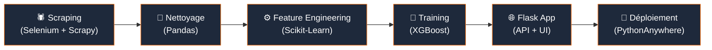

# ImmoPrix — Morocco Real Estate Price Estimator

Created by **Talib Abdeljalil & Saji Adnane**

AI-powered property price prediction for Morocco. Trained on live Mubawab listings, calibrated with Yakeey district-level reference prices.

**Live demo**: [abdo0.pythonanywhere.com](https://abdo0.pythonanywhere.com) *(deployed via PythonAnywhere)*

---

## Features

- Lightweight, fast prediction engine using Yakeey price/m² reference for 273 districts across 13 cities
- XGBoost model training available for local development and research
- Flask web interface with instant predictions
- Fuzzy district name matching for robust lookups
- For Sale & For Rent support
- Yakeey local benchmark calibration displayed alongside AI predictions
- Interactive city pricing charts with animated visualizations

---

## Architecture

The project follows a complete end-to-end pipeline from raw data acquisition to production deployment:



| Étape | Description | Outils |
|-------|-------------|--------|
| **Scraping** | Extraction automatisée des annonces immobilières depuis Mubawab.ma | Selenium, Scrapy, BeautifulSoup |
| **Nettoyage** | Suppression des doublons, filtrage des outliers (percentiles 1%-99%), validation des plages de prix (50K–50M MAD) et surfaces (20–500 m²) | Pandas, NumPy |
| **Feature Engineering** | Encodage catégoriel, création de ratios dérivés, features polynomiales | Scikit-Learn LabelEncoder |
| **Training** | Entraînement XGBoost avec validation croisée 5-fold, calibration Yakeey | XGBoost, Scikit-Learn |
| **Flask App** | API REST `/api/predict` + interface web responsive | Flask, Flask-CORS |
| **Déploiement** | Mode Mock Predictor (Yakeey-only) pour respecter la limite mémoire 512 MB | PythonAnywhere, Gunicorn |

---

## Dataset

Le modèle est entraîné sur un corpus combiné de **13 760 enregistrements** :

| Source | Records | Description |
|--------|---------|-------------|
| **Mubawab.ma** (scraping réel) | 220 | Annonces immobilières actuelles extraites via Selenium |
| **Yakeey** (données synthétiques) | 13 540 | Listings générés à partir des prix/m² de référence Yakeey pour 273 quartiers |

### Statistiques du dataset

| Métrique | Valeur |
|----------|--------|
| Nombre total d'échantillons | 13 760 |
| Prix moyen | 2 114 409 MAD |
| Écart-type prix | 2 037 561 MAD |
| Villes couvertes | 13 |
| Quartiers indexés | 273 |

### Génération synthétique

Pour chaque quartier référencé dans `yakeey_price_reference.csv` :
- **40 appartements** synthétiques (surface 40–200 m², prix basé sur `apartment_price_m2`)
- **15 villas** synthétiques (surface 200–600 m², prix basé sur `villa_price_m2` × 1.3)
- Ajout d'un bonus aménités proportionnel à la surface et au nombre d'équipements
- Bruit aléatoire ±10% pour diversifier les prix

---

## Preprocessing

Le pipeline de nettoyage applique les étapes suivantes dans l'ordre :

1. **Normalisation des colonnes** — Toutes les colonnes sont converties en minuscules
2. **Conversion numérique** — `price` et `surface` sont parsés en valeurs numériques
3. **Filtrage des outliers** :
   - Prix : suppression du 1er et 99ème percentile, puis plage `[50 000 – 50 000 000]` MAD
   - Surface : suppression du 1er et 99ème percentile, puis plage `[20 – 500]` m²
4. **Validation rooms/bedrooms/bathrooms** — Clipping entre 0 et 20, remplissage des valeurs manquantes par 0
5. **Extraction géographique** — Parsing `location` → `district` + `city` via split sur `,`
6. **Déduplication** — Suppression des doublons basée sur `(price, surface)`
7. **Ratio prix/m²** — Filtrage des enregistrements avec un ratio hors de `[1 000 – 100 000]` DH/m²

---

## Features

Le modèle utilise **19 features** en entrée :

### Features numériques directes
| Feature | Description |
|---------|-------------|
| `surface` | Surface habitable en m² |
| `rooms` | Nombre total de pièces |
| `bedrooms` | Nombre de chambres |
| `bathrooms` | Nombre de salles de bain |

### Features encodées (LabelEncoder)
| Feature | Source | Classes |
|---------|--------|---------|
| `district_encoded` | Quartier | 273+ valeurs uniques |
| `city_encoded` | Ville | 13 villes (Casablanca, Rabat, Marrakech, etc.) |
| `category_encoded` | Type de bien | Apartment, Villa |
| `listing_type_encoded` | Type d'annonce | For Sale, For Rent |

### Features dérivées (engineered)
| Feature | Formule | Objectif |
|---------|---------|----------|
| `amenity_count` | Somme des 7 booléens aménités | Capturer le niveau de standing global |
| `rooms_per_surface` | `rooms / surface` | Ratio densité d'aménagement |
| `bed_bath_ratio` | `bedrooms / max(bathrooms, 1)` | Ratio confort intérieur |
| `surface_sq` | `surface²` | Modéliser la relation non-linéaire prix/surface |

### Features booléennes (aménités)
| Feature | Description |
|---------|-------------|
| `terrace` | Terrasse |
| `garage` | Garage / Parking |
| `elevator` | Ascenseur |
| `concierge` | Concierge |
| `pool` | Piscine |
| `security` | Sécurité / Gardiennage |
| `garden` | Jardin |

---

## Métriques du Modèle

Le modèle **XGBoost** a été entraîné le 14 mai 2026 avec les hyperparamètres suivants :

```
n_estimators=400, learning_rate=0.05, max_depth=5,
subsample=0.8, colsample_bytree=0.8, min_child_weight=3,
reg_alpha=0.1, reg_lambda=1.0
```

### Performance

| Métrique | Valeur |
|----------|--------|
| **Training R²** | **0.9640** |
| **CV R² (5-fold)** | **0.934 ± 0.006** |
| CV R² fold 1 | 0.927 |
| CV R² fold 2 | 0.936 |
| CV R² fold 3 | 0.932 |
| CV R² fold 4 | 0.945 |
| CV R² fold 5 | 0.930 |

> **Note** : Les métriques MAE et RMSE n'ont pas été enregistrées dans le pipeline d'entraînement actuel. Le R² indique que le modèle explique ~96% de la variance des prix sur le jeu d'entraînement et ~93% en validation croisée.

### Calibration Yakeey

En production, les prédictions du modèle sont dynamiquement comparées aux prix de référence officiels Yakeey par quartier. L'interface affiche :
- Le **benchmark local** (prix/m² Yakeey du quartier sélectionné)
- La **déviation** entre la prédiction AI et la référence marché

---

## Quick Start

```bash
# Clone
git clone https://github.com/Abdou-webb/immoprix.git
cd immoprix

# Setup
python -m venv venv
venv\Scripts\activate        # Windows
pip install -r requirements.txt

# Run
python src/webapp/app.py
```

Open [http://localhost:5000](http://localhost:5000)

### Running Locally with XGBoost Enabled

By default, the deployed code bypasses the heavy `xgboost` library to prevent freezing on PythonAnywhere's 512MB free tier. If you are running the project locally and want to use the full trained AI model:

1. Make sure you have installed the full dependencies: `pip install xgboost scikit-learn pandas` (or just use `pip install -r requirements.txt`).
2. Open `src/models/Xgboost/predict.py`.
3. Locate the `__init__` function (around line 176) and **delete** these three lines:
   ```python
   print("[DEPLOY] Bypassing XGBoost to prevent PythonAnywhere memory crashes.")
   self._use_mock()
   return
   ```
4. Restart the Flask app. It will now load and use your trained `.joblib` models!

---

## Project Structure

```
immoprix/
├── data/
│   ├── mubawab_current_listings.csv   # Scraped training data (220 real listings)
│   └── yakeey_price_reference.csv     # District price/m² reference (273 districts)
├── src/
│   ├── scrap/                         # Selenium scrapers
│   │   └── mubawab_scraper_modern.py
│   ├── preprocessing/
│   │   └── retrain_models.py          # Data cleaning + model training pipeline
│   ├── models/Xgboost/
│   │   ├── predict.py                 # Prediction engine + Yakeey calibration
│   │   ├── model_xgb.json            # Trained XGBoost model (portable JSON)
│   │   ├── model_meta.json           # Feature list + encoder mappings
│   │   └── *.joblib                   # Serialized model bundle
│   ├── pipeline_orchestrator.py       # Full pipeline runner
│   └── webapp/
│       ├── app.py                     # Flask backend + Yakeey reference loader
│       ├── templates/index.html       # Premium responsive UI
│       └── static/
│           ├── css/style.css          # Design system (CSS variables, glassmorphism)
│           └── js/app.js              # Client logic, benchmark lookups, chart animations
├── requirements.txt                   # Full dependencies (includes XGBoost for local use)
├── requirements-deploy.txt            # Deploy-only (lightweight, no ML libraries)
└── README.md
```

---

## Tech Stack

| Component | Technology |
|-----------|------------|
| Backend | Flask, Flask-CORS |
| ML Model | XGBoost (Gradient Boosting) |
| Data Processing | Pandas, NumPy, Scikit-Learn |
| Scraping | Selenium, Scrapy, BeautifulSoup, Requests |
| Frontend | Vanilla HTML5 / CSS3 / ES6+ JavaScript |
| Typography | Google Fonts (Outfit, Plus Jakarta Sans) |
| Icons | Inline SVG |
| Deployment | PythonAnywhere, Gunicorn |

---

## Authorship

Created by **Talib Abdeljalil & Saji Adnane**

## License

MIT
